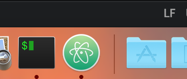
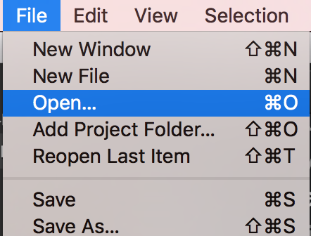
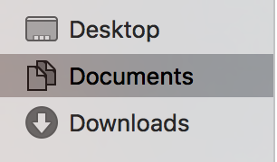
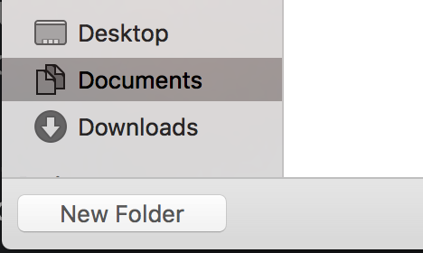
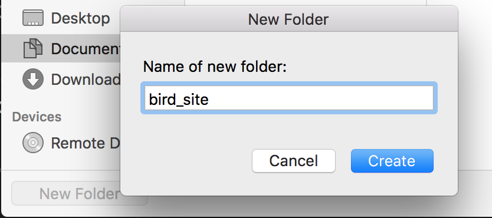
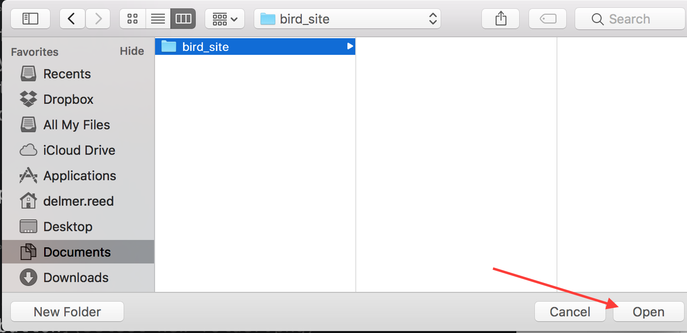
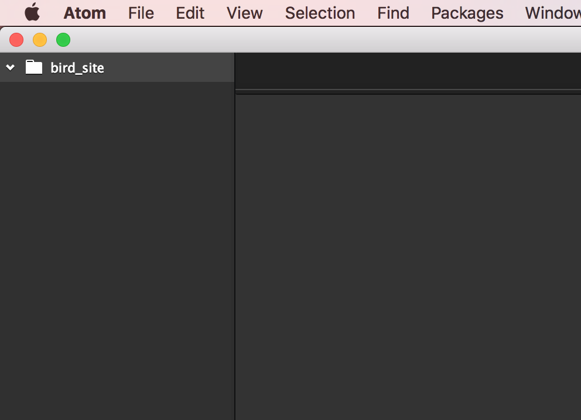

# Creating A New Atom Project
## Visual Steps

  * Click the [**Atom**](atom://atom) icon in your doc.

   

  * Hit `CMD + O` or go to `File > Open...` in your menubar.

   
   
  * Navigate to a folder directory you are familiar with. It might be easier for you to find your project later if you go to the `Documents` or `Desktop` directories.

  

  * Then click the `New Folder` option.

  

  * Provide the name of your project, `bird_site`, and click `create`.

  

  * Select your project folder and click the `Open` button.

   

You should see Atom open your new project.

